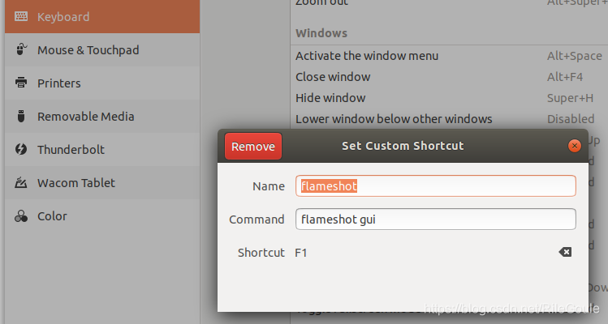

@[toc]

# 安装Ubuntu

# zsh环境配置

1）安装zsh

```bash
sudo apt-get update
```
安装一些工具
```bash
sudo apt-get install cmake git zsh curl net-tools
```

2）安装ohmyzsh

```bash
sh -c "$(curl -fsSL https://raw.github.com/robbyrussell/oh-my-zsh/master/tools/install.sh)"
```

3）安装插件

```bash
git clone https://github.com/zsh-users/zsh-syntax-highlighting.git ${ZSH_CUSTOM:-~/.oh-my-zsh/custom}/plugins/zsh-syntax-highlighting
git clone https://github.com/zsh-users/zsh-autosuggestions ${ZSH_CUSTOM:-~/.oh-my-zsh/custom}/plugins/zsh-autosuggestions
```

4）修改zshrc

```bash
gedit ~/.zshrc
```

在文件中添加

```bash
plugins=(git
zsh-autosuggestions
zsh-syntax-highlighting
)
alias ezs="gedit ~/.zshrc"
alias szs="source ~/.zshrc"
alias sss="source devel/setup.zsh"
source /opt/ros/noetic/setup.zsh
# export PATH=~/anaconda3/bin:$PATH

setopt no_nomatch # 允许使用 *缺省
```

4）安装terminator

```bash
sudo apt-get install terminator
```

安装后创建目录

```bash
mkdir ~/.config/terminator
gedit ~/.config/terminator/config
```

讲下面内容拷贝进去，并保存

```bash
[global_config]
  title_font = Ubuntu Mono 11[keybindings]
[keybindings]
[layouts]
  [[default]]
    [[[child1]]]
      parent = window0
      type = Terminal
    [[[window0]]]
      parent = ""
      size = 1200, 600
      type = Window
[plugins]
[profiles]
  [[default]]
    background_color = "#002b36"
    background_darkness = 0.91
    background_image = None
    background_type = transparent
    font = Ubuntu Mono 15
    foreground_color = "#e0f0f1"
    show_titlebar = False
    use_system_font = False

```

# anaconda(For Learning)

anaconda直接官网下载就好了，安装完后在zshrc中添加

```bash
export PATH=~/anaconda3/bin:$PATH# >>> conda initialize >>># !! Contents within this block are managed by 'conda init' !!__conda_setup="$('/home/yunfan/anaconda3/bin/conda' 'shell.zsh' 'hook' 2> /dev/null)"if [ $? -eq 0 ]; then    eval "$__conda_setup"else    if [ -f "/home/yunfan/anaconda3/etc/profile.d/conda.sh" ]; then        . "/home/yunfan/anaconda3/etc/profile.d/conda.sh"    else        export PATH="/home/yunfan/anaconda3/bin:$PATH"    fifiunset __conda_setup# <<< conda initialize <<<
```


# eigen

```bash
sudo apt-get install libeigen3-dev 
sudo ln -s /usr/include/eigen3/Eigen /usr/include/Eigen
```


# ROS
## ros-melodic
http://wiki.ros.org/melodic/Installation/Ubuntu

```bash
sudo apt-get install curl
sudo sh -c 'echo "deb http://packages.ros.org/ros/ubuntu $(lsb_release -sc) main" > /etc/apt/sources.list.d/ros-latest.list'
sudo apt install curl # if you haven't already installed curl
curl -s https://raw.githubusercontent.com/ros/rosdistro/master/ros.asc | sudo apt-key add -
sudo apt update
sudo apt install ros-melodic-desktop-full
echo "source /opt/ros/melodic/setup.zsh" >> ~/.zshrcsource ~/.zshrc
```
## ros-noetic
ros-noetic
```
# Setup your computer to accept software from packages.ros.org.
sudo sh -c 'echo "deb http://packages.ros.org/ros/ubuntu $(lsb_release -sc) main" > /etc/apt/sources.list.d/ros-latest.list'
# Set up your keys
sudo apt install curl # if you haven't already installed curl
curl -s https://raw.githubusercontent.com/ros/rosdistro/master/ros.asc | sudo apt-key add -

sudo apt update
sudo apt install ros-noetic-desktop-full
echo "source /opt/ros/noetic/setup.zsh" >> ~/.zshrc
source ~/.zshrc
```
# mavros pcl plot-juggler

```bash
sudo apt install ros-noetic-mavros*
sudo apt install ros-noetic-pcl*
sudo ln -s /usr/include/pcl-1.8/pcl /usr/include/pcl
sudo apt install ros-noetic-plotjuggler*
sudo apt install ros-noetic-view-controller-msgs
sudo apt install ros-noetic-octomap* 
```

# QGC
```bash
sudo usermod -a -G dialout $USER
sudo apt-get remove modemmanager -y
sudo apt install gstreamer1.0-plugins-bad gstreamer1.0-libav gstreamer1.0-gl -y
sudo apt install libqt5gui5 -y
sudo apt install libfuse2 -y
```
Download QGroundControl.AppImage. Copy it to App folder.
Install (and run) using the terminal commands:
```bash
sudo /opt/ros/noetic/lib/mavros/install_geographiclib_datasets.sh
chmod +x ./QGroundControl.AppImage
./QGroundControl.AppImage
```

# clion

clion装好后要装三个插件比较舒服

* CodeGlance
* Hatchery
* Rainbow Brackets

# simplescreenrecorder

录屏软件

```bash
 sudo apt-get install simplescreenrecorder
```
# 搜狗输入法
https://shurufa.sogou.com/linux


# flameshot

截图软件

```bash
sudo apt-get install flameshot
```

添加快捷键：在系统设置的keymap里




# VLC

视屏播放软件

```bash
sudo apt-get install vlc
```

# git ssh生成

```bash
ssh-keygen -t rsa -C “your-email”
```
一路回车
然后
```bash
cat ~/.ssh/id_rsa.pub
```
将得到的链接复制进入github -> Settings -> SSH and GPG keys -> new SSH key，取个名字即可

# Ceres
安装相关依赖

```bash
# CMake
sudo apt-get install cmake
# google-glog + gflags
sudo apt-get install libgoogle-glog-dev libgflags-dev
# BLAS & LAPACK
sudo apt-get install libatlas-base-dev
# Eigen3
sudo apt-get install libeigen3-dev
# SuiteSparse and CXSparse (optional)
sudo apt-get install libsuitesparse-dev
```
下载压缩包并解压，压缩包地址
http://ceres-solver.org/ceres-solver-2.0.0.tar.gz
(Release里面也有）

```bash
tar zxf ceres-solver-2.0.0.tar.gz #安装了zsh的extract插件，则可以直接用 x + filename解压
cd ceres-solver-2.0.0
mkdir build
cd build
cmake .. #生成makefile
make -j4 #编译
make test
sudo make install #安装
```
测试，继续在build路径下输入

```bash
bin/simple_bundle_adjuster ../data/problem-16-22106-pre.txt 
```
若出现下图所示结果，则说明安装成功。


## CmakeLists.txt如何使用Ceres

```cpp
find_package(Ceres REQUIRED)
include_directories(include    ${CERES_INCLUDE_DIRS})
```
# 截动图GIF工具byzanz

```bash
sudo apt-get install byzanz #下载byzanz
```
有一个小工具xdotool可以获取鼠标的所在坐标

```bash
sudo apt-get install xdotool
```
命令行输入

```bash
xdotool getmouselocation
```
可以得到鼠标当前的X，Y值，只需要知道所需举行区域左上和右下角的坐标即可截取GIF

## 截图

```bash
byzanz-record -x 506 -y 132 -w 1019 -h 616  -d 10 --delay=5 -c  test.gif
```
这里设置延时5秒开始录制，录制时长为10秒，并输出到当前位置成test.gif文件，矩形左上角坐标为x=506, y=132，宽度为1019, 高度616.

## 参数
 byzanz主要的参数选项有：
  -d, --duration=SECS     动画的时间 (默认：10 秒)
  -e, --exec=COMMAND      Command to execute and time
  --delay=SECS            开始之前的延时(默认：1 秒)
  -c, --cursor            录制鼠标光标
  -a, --audio             录音
  -x, --x=像素            要录制矩形的 X 坐标
  -y, --y=像素            要录制矩形的 Y 坐标
  -w, --width=像素        录制矩形的宽度
  -h, --height=像素       录制矩形的高度
  -v, --verbose           详细
  --display=显示          要使用的 X 显示
# Backwardcpp

```bash
 sudo apt-get install libdw-dev 
```

随后下载头文件
https://raw.githubusercontent.com/bombela/backward-cpp/master/backward.hpp
复制到根目录
sudo mv backward.hpp /usr/include
在CmakeLists.txt target_link lib 后面加个 "dw"

# 添加python环境变量
当编译程序报错：找不到<Python.h>时，可能是没有声明环境变量。
修改 ~/.zshrc
```bash
export CPATH=/usr/include/python3.8:$CPATH
export LD_LIBRARY_PATH=/usr/lib:$LD_LIBRARY_PATH
```
# OOQP

https://github.com/RENyunfan/ooqp_group

# fmt, livox-sdk
进入fmt库的文件夹，执行以下命令

```bash
mkdir build
cd build/
cmake -DBUILD_SHARED_LIBS=TRUE ..
make
sudo make install
sudo cp /usr/local/lib/libfmt.so.8 /usr/lib
```

livox-sdk
```bash
mkdir build && cd build
cmake ..
make
sudo make install
```
# GTSAM

安装依赖

```
sudo apt-get install libboost-all-dev
sudo apt-get install cmake
sudo apt-get install libtbb-dev
```
下载GTSAM压缩包(见Release)并解压，进入GTSAM文件夹
```
mkdir build
cd build
cmake ..
make check (optional, runs unit tests)
sudo make install
sudo cp /usr/local/lib/libgtsam.so.4 /usr/lib
sudo cp /usr/local/lib/libmetis-gtsam.so /usr/lib
```
# wifi driver 88x2bu-5.8.7.4 (Skip this step)

常规安装
驱动解压的用户目录的下载目录，打开解压后的驱动文件夹，空白处点击鼠标右键打开终端
sudo gedit /etc/NetworkManager/NetworkManager.conf
将 managed=false 改成 true
然后在有makefile的目录里
sudo make
sudo make install
reboot

# 配置AdHoc点对点通信

* 将ad_hoc.sh复制到主目录下

```bash
sudo chmod 777 ad_hoc.sh  #授予权限
```

* 将脚本中的wlo1修改为自己电脑中的网卡名，可以用`ifconfig`查看

  `10.0.0.x`即为设定的IP，要确保每个电脑的这个值不同。

  目前已有的三架飞机分别为 `10.0.0.101, 10.0.0.102, 10.0.0.103`，之后依次递增。

  控制飞机的主机以及地面站可以设置为 `10.0.0.x`，x < 100且不相同即可，如`10.0.0.8`。

* 启动AdHoc模式

  ```
  sh ad_hoc.sh
  ```

  然后用iwconfig查看网卡状态，如果如下所示有Cell值，且ESSID为设定的名称 djiadhoc，Mode为Ad-Hoc即为成功。
  
  Exit the AdHoc convert to WiFi mode use command "sudo service network-manager restart"

## NUC开机启动AdHoc：

开机自启动
crontab -e，
Select an editor, choose 1.
crontab -l,
在最后写入

```
@reboot sleep 5; echo " " | sudo -S ~/ad_hoc.sh
@reboot sleep 30; echo " " | sudo -S ~/ad_hoc.sh
```

ctrl + x保存退出

# Typora
```bash
# or use
# wget -qO - https://typora.io/linux/public-key.asc | sudo apt-key add -
wget -qO - https://typoraio.cn/linux/public-key.asc | sudo tee /etc/apt/trusted.gpg.d/typora.asc

# add Typora's repository
sudo add-apt-repository 'deb https://typora.io/linux ./'
sudo apt-get update

# install typora
sudo apt-get install typora
```

# FlightPlot
https://blog.csdn.net/qq_33641919/article/details/106883279?ops_request_misc=%257B%2522request%255Fid%2522%253A%2522165786853316781432947100%2522%252C%2522scm%2522%253A%252220140713.130102334..%2522%257D&request_id=165786853316781432947100&biz_id=0&utm_medium=distribute.pc_search_result.none-task-blog-2~all~sobaiduend~default-1-106883279-null-null.142^v32^pc_rank_34,185^v2^control&utm_term=flightplot%E4%BD%BF%E7%94%A8%E6%96%B9%E6%B3%95&spm=1018.2226.3001.4187
